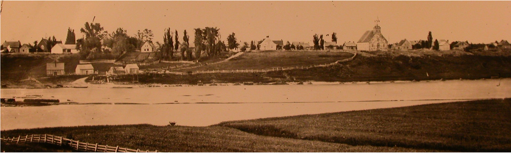

# Resources

> Gene tree is a website dedicated to visualizing genealogies through space and time.

> The BALSAC genealogy is made of millions of parish records dating back to the arrival of the first French settlers four centuries ago. These records have been compiled thanks to multiple institutions and decades of work, click more info for more details.

> To get the full story, we suggest reading the paper which provides more context, interpretations of results, and details about the methods and data.
